# 🚦 Maseer (مسير) - Intelligent Traffic Violation Detection System


<p align="center">  </p>


<br><br>

## 📖 Table of Contents  

- 📌 [Project Introduction](#project-introduction)  
- 🚦 [Traffic Violation Types](#traffic-violation-types)  
- 🎯 [Output Preview](#output-preview)
- 📂 [Codebase Structure](#codebase-structure)
- 🛠️ [Technologies Used](#technologies-used)
- 🔍 [How It Works: Detection Pipeline](#how-it-works-detection-pipeline)
  - 🚘 [Phase 1: Violation Detection](#phase-1-violation-detection)
  - 📊 [Phase 2: Data Extraction](#phase-2-data-extraction)
- 📈 [Testing & Evaluation](#testing--evaluation)
- ⚙️ [Installation & Setup](#installation--setup)  
- 🔮 [Future Enhancements](#future-enhancements)
- 📬 [Connect](#connect)


<br><br>

## 📌 Project Introduction

### 🚀 Overview
**Maseer** is an **AI-powered solution** designed to **automate** the detection and identification of **traffic priority violations** using video footage from regular drivers' **Dashcams**. By leveraging **computer vision** and **machine learning**, Maseer processes Dashcam recordings to **identify specific traffic violations**, addressing gaps in **traditional traffic monitoring systems**. This approach enhances **road safety** and **empowers drivers** to contribute to **law enforcement efforts**, streamlining **violation reporting** while protecting their **rights**.

### 🎯 Objectives
✅ **Leverage Dashcam footage** → Minimize the need for physical traffic police presence.  
✅ **Automate violation detection** → Reduce the workload for both Dashcam owners and traffic authorities.  
✅ **Facilitate data-driven reporting** → Assist victims of priority violations in filing accurate reports.  
✅ **Enhance traffic management** → Utilize advanced technology for precise and efficient violation monitoring.  

<br><br>


## 🚦 Traffic Violation Types  
Maseer focuses on detecting and identifying **traffic priority violations**, specifically **sudden lane change violations**. This violation occurs when a driver **fails to yield to a vehicle already in the target lane** while switching lanes, creating a hazardous situation. The violation is characterized by:

🚗 **A vehicle (🔴 red) attempting to switch lanes without yielding to a vehicle (🔵 blue) already in that lane**, causing potential accidents.  
📏 **A minimum safe distance of three meters is not maintained**, leading to unsafe conditions.  
⚠️ **Sudden and reckless lane changes** disrupt traffic flow and increase accident risks.  

<p align="center">  
  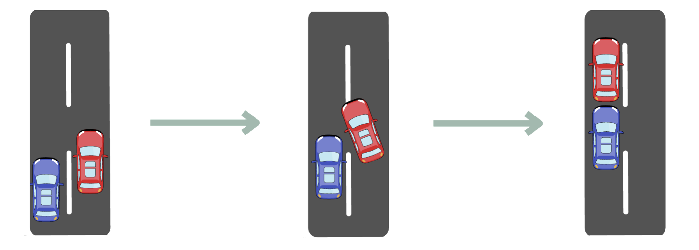  
</p>

In the figure above:  
- The **🔵 blue vehicle holds priority** in its current lane.  
- The **🔴 red vehicle violates priority** if it switches lanes without waiting for the blue vehicle to pass.  
- A violation occurs if the red vehicle **cuts too closely in front**, disrupting the blue vehicle’s passage and increasing accident risk.  

<br><br>


## 🎯 Output Preview

This GIF illustrates the system's input and output:

### 🎥 Input

#### Dashcam Video  
- **Description:** The footage may contain a lane change violation.  
- **Note:** While this is a short clip for demonstration, the system can process longer videos. The output video automatically trims to highlight only the violation segment.


### 📤 Output

For each detected violation, the system generates:

#### 🎬 Trimmed Violation Video  
- **Description:** Displays the violation with the offending vehicle highlighted using a bounding box.

#### 🧾 Extracted Violation Data  
The following data is extracted for each detected violation:

1. **Total Violations Detected**
2. **Details per Violation:**
   - **Vehicle ID**
   - **First & Last Frame:** When the vehicle first and last appears
   - **Vehicle Information (with Confidence Scores):**
     - **Plate Digits**
     - **Plate Letters**
     - **Date & Time** of the violation

> 🎥
<p align="center">  
   
</p>  

### 📱 Mobile App Integration

This GIF demonstrates how the backend integrates with a mobile app UI in two different scenarios:

- 📹 **Case 1:** A video containing a sudden lane change violation.  
- 📹 **Case 2:** A video with no detected violations.

In both cases:
- Users can **upload dashcam footage** directly from the app.
- The backend processes the video and returns results accordingly.
- If violations are detected, **trimmed clips** and **detection metadata** are shown in the app interface.
- If no violations are found, the user is notified accordingly.
- Users can also browse history, receive alerts, and manage their account through the app.

> 🎥
<p align="center">  
   
</p>  

<br><br>


## 📂 Codebase Structure

This project includes **backend APIs, video analysis scripts, and a YOLOv8 model**.
**Frontend UI, full database schema, and the license_plate_detection model are not included.**

### 🧠 `analysing/`
Computer vision scripts:
- `violationDetect.py` – Traffic violation detection.
- `dataExtract.py` – Data Extracting from video.

### 📦 `models/`
AI model files:
- `yolov8n.pt` – YOLOv8 object detector.
- *(Your custom `license_plate_detector.pt` goes here — not included in the repository)*

### 🔌 `routers/`
FastAPI route handlers:
- `signup.py`, `login.py`, `userdata.py`, `updatePhone.py`, `updatePassword.py`
- `deleteAccount.py`, `deleteOneReport.py`, `historyList.py`
- `report.py`, `uploadVideo.py`, `sendEmail.py`, `PasswordRecover.py`

### 📄 Root Files
- `main.py` – FastAPI app entry point.
- `database.py` – MySQL config and queries.
- `models.py` – Pydantic models for request/response validation.
- `requirements.txt` – Python dependencies.
- `README.md` – Project documentation.

> ⚠️ **Note:** This is a backend-only implementation with integrated video processing and ML models. Requires a configured MySQL DB and a license plate detection model.


<br><br>


## 🛠️ Technologies Used

- 🐍 **Python**, ⚡ **FastAPI** – Backend & API  
- 👁️ **OpenCV**, 🧠 **YOLOv8 (Ultralytics)** – Object detection  
- 🔤 **EasyOCR** – License plate recognition  
- 📚 **PyTorch**, 🌐 **TensorFlow** – ML/DL models  
- 🗄️ **MySQL**, 🛠️ **phpMyAdmin** – Database & management

<!--
## 🛠️ Technologies Used

### 👁️ Computer Vision
- 🧰 **OpenCV**  
- 🎯 **YOLOv8 (Ultralytics)**  
- 🔤 **EasyOCR**

### 🧠 AI & Deep Learning
- 🔬 **PyTorch**  
- 🌐 **TensorFlow**

### ⚙️ Backend & API
- 🐍 **Python**  
- ⚡ **FastAPI**

### 🗄️ Database
- 🛢️ **MySQL**  
- 🛠️ **phpMyAdmin**
-->

<br><br>


## 🔍 How It Works: Detection Pipeline

The process of analyzing videos to identify and extract data related to sudden lane change violations comprises **two primary phases**, as illustrated below.

<p align="center">  
  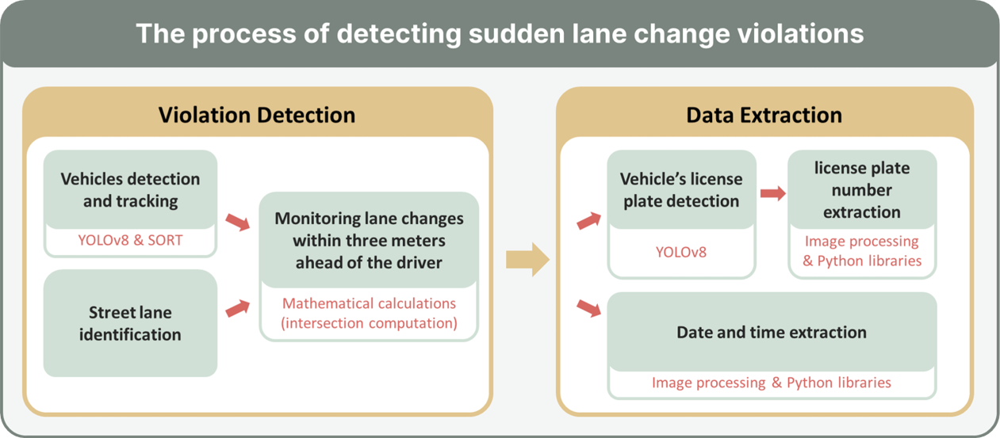  
</p>

> ### 🔍 Detection Pipeline Phases
### 🚘 Phase 1: Violation Detection  
This phase involves:  
✅ **Vehicle Detection & Tracking**: Uses **YOLOv8n** for vehicle detection and **SORT** algorithm for tracking objects across frames.  
✅ **Street Lane Detection**: Utilizes **Hough Transform** and **Transition Lines** for lane marking identification.  
✅ **Monitoring Lane Changes**: Identifies vehicles violating priority rules within **3 meters** using **trajectory analysis** and **intersection detection**.

#### 🚗 Vehicle Detection and Tracking
- **YOLOv8n Model**: Detects a wide range of vehicles (cars, trucks, bikes).  
- **SORT Algorithm**: Assigns unique IDs to track vehicles across frames.  

<p align="center">  
  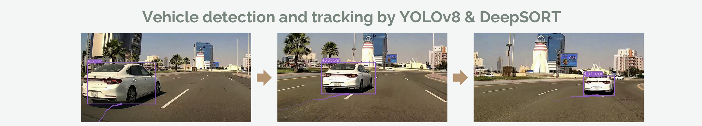  
</p>

#### 🛣️ Street Lane Detection
##### **Approach 1: Hough Transform Algorithm**
- Used **Gaussian Blur + Canny Edge Detection** to process images.
- **Hough Transform** was applied to detect lane markings.  
- ❌ **Limitations**: Inconsistent results leading to **false positives & negatives**.

<p align="center">  
  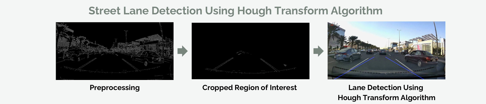  
</p>

##### **Approach 2: Transition Lines**
- Defined **two static lines** on the video frames to mark lane boundaries.  
- ✅ **More consistent** for detecting lane changes within **3 meters**.  
- ❌ **Limitations**: Works best when the Dashcam remains **static**.

<p align="center">  
  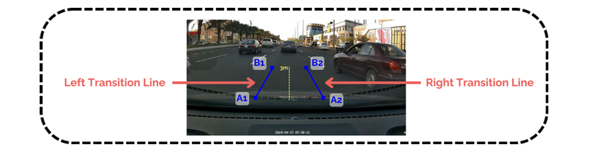  
</p>


#### 🔄 **Monitoring Lane Changes**  
The system detects **sudden lane change violations** when vehicles switch lanes **too close (≤3 meters)** to the driver.  

##### 📍 **Key Points Calculation**  
Each vehicle’s movement is tracked using:  
- **Left Point** → (x1, y2)  
- **Right Point** → (x2, y2)  
- **Center Point** → \( \left(\frac{x1 + x2}{2}, y2 \right) \)  

<p align="center">  
  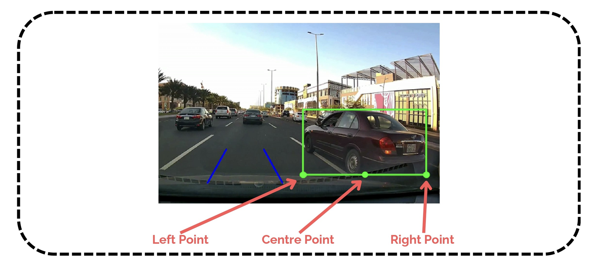  
</p>  


##### 📈 **Trajectory & Intersection Detection**  
The system tracks **left, right, and center points** across frames to determine lane change violations.  

A **violation is detected** if the trajectory intersects a **transition line**:  
- **Step 1:** Check if **left or right point** crosses a transition line → 🚨 Possible violation.  
- **Step 2:** Confirm if **center point** crosses the same line → ✅ Violation confirmed.  

<p align="center">  
  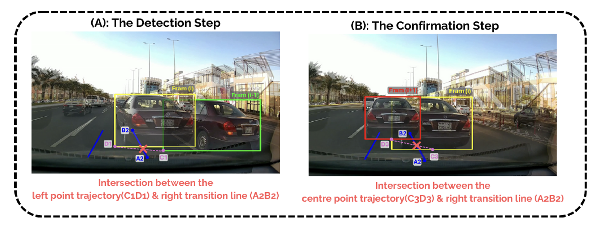  
</p>  


### 📊 Phase 2: Data Extraction
Once a violation is detected, **relevant data** is extracted for reporting.

✅ **License Plate Detection** → Identifies and extracts vehicle license plate details.  
✅ **License Plate OCR** → Uses **EasyOCR** for text recognition and conversion.  
✅ **Date & Time Extraction** → Extracts timestamp for accurate reporting.

#### 🔢 License Plate Detection & OCR
- Trained **YOLOv8n** on a **24,242-image dataset** for license plate detection.  
- **EasyOCR** extracts the plate number from detected frames.  
- Ensures **93% accuracy** for extracted license plate numbers.

<p align="center">  
  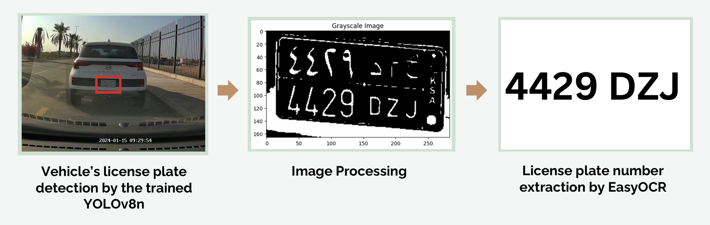  
</p>

#### ⏳ Date & Time Extraction
- Uses **OpenCV** for region cropping and **EasyOCR** for text recognition.  
- **Formatted extraction**: `YYYY-MM-DD` (date) and `HH:MM:SS` (time).  
- Ensures **accurate violation reporting** with a **minimum confidence threshold of 40%**.

<p align="center">  
  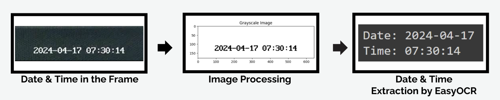  
</p>

<br><br>


## 📈 **Testing & Evaluation**  
To ensure the accuracy and reliability of **Maseer**, multiple testing phases were conducted on different system components, including **violation detection** and **data extraction**.  

### 🚦 **Violation Detection Testing**  
The system was tested on **71 videos** (4–85 seconds long), covering **day and night** conditions. The videos were categorized into:  
- **Violations (V)**: Lane changes within **3 meters**.  
- **Non-Violations (C)**: Lane changes **beyond 3 meters**.  
- **Normal Driving (N)**: No lane change.  

📊 **Results Summary:**  
📌 **Achieved an accuracy of 95%**, even on low-quality videos (as low as **480p x 272p**).  
<p align="center">  
  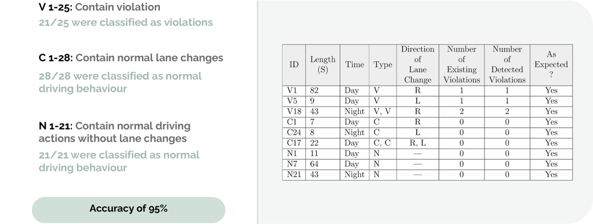 
</p>  

### 🔍 **Data Extraction Testing**  

The system was tested on:  
- **19 videos & 50 images** for license plate extraction.  
- **60 videos** for date/time extraction.  

📊 **Results Summary:**  
📌 **Overall Accuracy:** **78%** for data extraction.  
<p align="center">  
  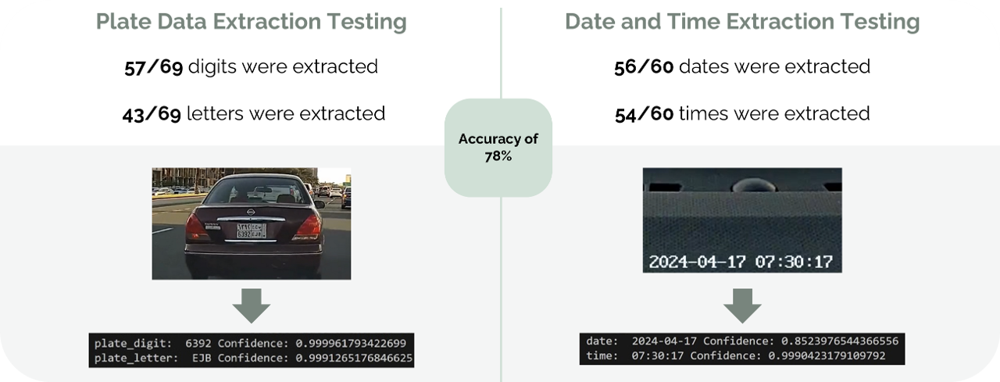  
</p>  


<br><br>


## ⚙️ Installation & Setup

Follow these steps to set up and run the project:

### 1️⃣ Clone the Repository
```bash
 git clone https://github.com/NuhaMakki/MASEER_Traffic_Violation_Detection_System.git
 cd MASEER_Traffic_Violation_Detection_System
```

### 2️⃣ Install Dependencies
```bash
pip install -r requirements.txt
```

### 3️⃣ Clone Sort Module
The sort module needs to be downloaded from [this repository](https://github.com/abewley/sort)
```bash
 cd analysing
 git clone https://github.com/abewley/sort
 cd sort
 pip install -r requirements.txt
```
### 4️⃣ Place Required Files
- Add your trained model **license_plate_detector.pt** inside the `models` folder.

### 5️⃣ Configure Database Connection
Modify `database.py` if needed:
```python
def connect_to_mysql():
    # Database configuration details
    config = {
        'host': 'localhost',
        'database': 'maseerdb',
        'user' : 'root',
        'password' : ''
    }
```

### 6️⃣ Configure Email Sending
Edit `routers/sendEmail.py` and update the following SMTP settings:
```python
# Function to send verification email
def send_verification_email(email: int, otp_code: str, email_Subject: str):
    # Set up SMTP server details
    smtp_server = 'smtp.xxxx.com'
    smtp_port = 465  # for SSL
    sender_email = 'xxxx@mail.com'
    sender_password = 'xxxxxxx'
```
Replace the placeholder values with your actual SMTP credentials.

### 7️⃣ Run the Project
```bash
uvicorn main:app --reload
```

This will start the FastAPI server, and you can access the API at `http://127.0.0.1:8000/`.

### 🎯 Additional Notes
- Ensure MySQL is running before launching the project.
- Use a virtual environment to manage dependencies.
- Modify `.env` or `config.py` (if applicable) for sensitive configurations.
- Check `logs/` for debugging issues if needed.

Now you’re ready to use **MASEER Traffic Violation Detection System**! 🚦🚗💨


<br><br>


## 🔮 Future Enhancements

- 🛣️ Integrate street lane detection functionality  
- 🎯 Enhance the accuracy and reliability of AI models  
- 🔐 Improve system security to defend against internal and external threats  
- 🚦 Extend detection to more traffic priority violations

<br><br>


## 📬 Connect
If you have any questions or suggestions, feel free to connect!

<div align="center">

<a href="mailto:noha.m.makki@gmail.com" rel="nofollow">
  
</a>

<a href="https://www.linkedin.com/in/nuha-makki-a3b15a2b9/" rel="nofollow">
  
</a>

<a href="https://github.com/NuhaMakki" rel="nofollow">
  
</a>

</div>


