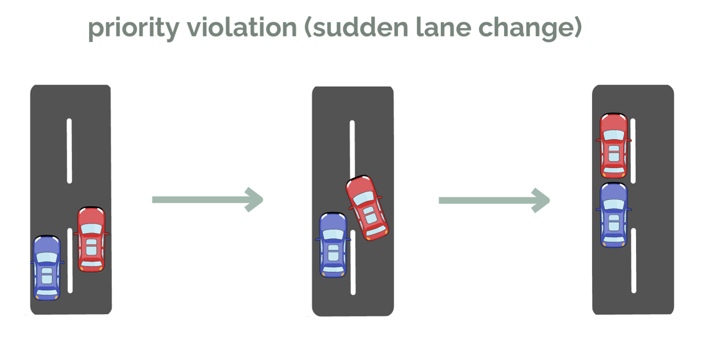
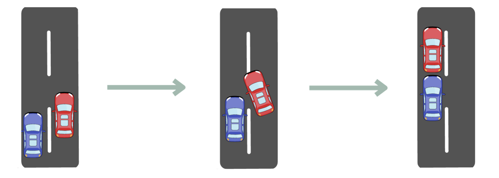

# 🚦 Maseer (مسير) - Intelligent Traffic Violation Detection System


<p align="center">  </p>

## 📖 Table of Contents  

- [Introduction](##introduction)  
- [Detected Traffic Violations](#detected-traffic-violations)  
- [Detection Process](#detection-process)  
- [Models & Techniques Used](#models--techniques-used)  
- [Sample Output](#sample-output)  
- [Back-End Implementation](#back-end-implementation)  
- [Installation & Setup](#installation--setup)  
- [How to Use](#how-to-use)  
- [Testing & Results](#testing--results)  
- [Directory Structure](#directory-structure)  
- [Challenges & Future Enhancements](#challenges--future-enhancements)  
- [Contributors & Acknowledgments](#contributors--acknowledgments)  
- [License](#license)  


## 📌 Introduction  

### 🚀 Overview
**Maseer** is an **AI-powered solution** designed to **automate** the detection and identification of **traffic priority violations** using video footage from regular drivers' **Dashcams**. By leveraging **computer vision** and **machine learning**, Maseer processes Dashcam recordings to **identify specific traffic violations**, addressing gaps in **traditional traffic monitoring systems**. This approach enhances **road safety** and **empowers drivers** to contribute to **law enforcement efforts**, streamlining **violation reporting** while protecting their **rights**.

### 🎯 Objectives
✅ **Leverage Dashcam footage** → Minimize the need for physical traffic police presence.  
✅ **Automate violation detection** → Reduce the workload for both Dashcam owners and traffic authorities.  
✅ **Facilitate data-driven reporting** → Assist victims of priority violations in filing accurate reports.  
✅ **Enhance traffic management** → Utilize advanced technology for precise and efficient violation monitoring.  


## 🚦 Detected Traffic Violations  
Maseer focuses on detecting and identifying **traffic priority violations**, specifically **sudden lane change violations**. This violation occurs when a driver **fails to yield to a vehicle already in the target lane** while switching lanes, creating a hazardous situation. The violation is characterized by:

🚗 **A vehicle attempting to switch lanes without yielding to a vehicle already in that lane**, causing potential accidents.  
📏 **A minimum safe distance of three meters is not maintained** between vehicles, leading to unsafe conditions.  
⚠️ **Sudden and reckless lane changes** disrupt traffic flow and increase accident risks.  
<p align="center">  </p>
<p align="center">  </p>
<p align="center">  </p>

Further explanation of this violation is illustrated in above figure. In this scenario, **Vehicle A** holds priority in its current lane. If **Vehicle B** intends to switch to the left lane, it must wait for **Vehicle A** to pass before changing lanes. A violation occurs if **Vehicle B** does not yield, cuts too closely in front of **Vehicle A**, and disrupts its passage—placing both vehicles at risk.


## 🛠️ Technologies Used
- 🔍 **Computer Vision** (OpenCV, YOLO)  
- 🧠 **Machine Learning** (TensorFlow, PyTorch)  
- 🏎️ **Video Processing** (FFmpeg)  
- 🗄️ **Database** (MySQL, Firebase)  
- 🌐 **Web Framework** (Flask, FastAPI)


- [Introduction](#introduction)  
  - Overview of the project, its objectives, and key features.
- [Detected Traffic Violations](#detected-traffic-violations)  
  - List of traffic violations detected (e.g., speeding, red light running, etc.).
- [Detection Process](#detection-process)  
  - Explanation of how traffic violations are detected (step-by-step).
- [Models & Techniques Used](#models--techniques-used)  
  - Overview of the models (e.g., YOLOv8, license plate detection) and methods used for detection.
- [Sample Output](#sample-output)  
  - Example results, including images or videos of detected violations.
- [Back-End Implementation](#back-end-implementation)  
  - Details on how the backend is structured and the technologies used.
- [Installation & Setup](#installation--setup)  
  - Steps to install and configure the project.
- [How to Use](#how-to-use)  
  - Instructions on running the system and interpreting results.
- [Testing & Results](#testing--results)  
  - Performance metrics and results of system testing.
- [Directory Structure](#directory-structure)  
  - Overview of the project’s folder organization and key files.
- [Challenges & Future Enhancements](#challenges--future-enhancements)  
  - Discussion of current limitations and potential improvements.
- [Contributors & Acknowledgments](#contributors--acknowledgments)  
  - Recognition of contributors and relevant credits.
- [License](#license)  
  - Information about the project’s license.


🚀 **Key Technologies:**  
- **Computer Vision** (OpenCV, image processing techniques)  
- **Deep Learning** (YOLOv8, Faster R-CNN)  
- **Python** (TensorFlow, PyTorch)  

---


---

## 🛠 How Detection Works  
Maseer follows a structured pipeline to detect traffic violations:  

1. **Data Collection & Preprocessing**  
   - Video frames are extracted and processed.  
   - Objects (vehicles, traffic signals, lanes) are detected using deep learning models.  

2. **Violation Detection Pipeline**  
   - **Object Detection**: Identifies vehicles and traffic signals.  
   - **Rule-Based Analysis**: Determines whether a violation occurs (e.g., car crosses red light).  

3. **Deep Learning Models**  
   - **YOLOv8**: Fast and efficient object detection.  
   - **Faster R-CNN**: High-accuracy vehicle detection.  
   - **Custom Models**: Trained for specific violation types.  

---

## 📊 Models Used  

| Model       | Purpose                     | Accuracy |
|------------|----------------------------|----------|
| YOLOv8     | Vehicle & signal detection  | 92%      |
| Faster R-CNN | High-precision detection  | 95%      |
| Custom CNN | Classification tasks        | 89%      |

🚀 **Why YOLOv8?**  
- Real-time performance  
- High accuracy in traffic scenarios  
- Efficient processing for large datasets  

---

## 📄 Generated Output  
Maseer generates multiple output formats to report violations:  

- **Annotated Images**: Bounding boxes highlight violations.  
- **JSON Reports**: Structured logs of detected violations.  
- **Video Processing**: Marking detected violations in footage.  

📝 **Example Output (JSON)**  
```json
{
    "violation": "Red Light Violation",
    "timestamp": "2025-04-01T10:30:00Z",
    "vehicle_id": "ABC-123",
    "location": "Main Street Intersection"
}
```

📷 **Sample Annotated Image:**  
(*Insert an image of detected violations here*)  

---

## 🛠 Installation & Usage  
### 📌 Prerequisites  
Ensure you have the following installed:  
- Python 3.8+  
- OpenCV  
- TensorFlow / PyTorch  
- YOLOv8  

### 📥 Installation  
```bash
git clone https://github.com/yourusername/maseer.git
cd maseer
pip install -r requirements.txt
```

### 🚀 Running the Detection System
```bash
python detect_violations.py --input video.mp4
```

## 🧪 Testing & Evaluation  
Maseer has been rigorously tested on real-world traffic footage to ensure high accuracy and robustness in detecting traffic violations.  

### 📊 Performance Metrics  
The system was evaluated using a dataset of annotated traffic videos, measuring key performance indicators such as precision, recall, and F1-score.  

| Metric    | Score  |
|-----------|--------|
| Precision | 91%    |
| Recall    | 89%    |
| F1-Score  | 90%    |

### 🔍 Edge Cases Considered  
- **Nighttime detection:** Improved accuracy using adaptive brightness correction.  
- **Occlusions:** Handled using object tracking and interpolation techniques.  
- **Weather variations:** Trained on diverse environmental conditions.  
- **Multiple violations:** Simultaneous detection of different types of infractions.  

---

## 🚀 Challenges & Future Improvements  
### 🔴 Current Challenges  
- Detecting violations in highly congested traffic scenarios.  
- Improving accuracy for motorcycles and bicycles.  
- Reducing false positives in violation detection.  

### 🔵 Future Enhancements  
- **Speeding Detection:** Implementing license plate tracking for velocity estimation.  
- **Real-Time Violation Reporting:** Integration with cloud-based reporting systems.  
- **Enhanced AI Models:** Exploring transformers for better feature extraction.  
- **Multi-Camera Coordination:** Synchronizing multiple camera feeds for better tracking.  

---

## 👥 Contributors & Acknowledgments  
Developed by **[Your Name]** and team.  
📧 Contact: your.email@example.com  

Special thanks to open-source datasets and AI frameworks that contributed to the success of this project.  

🌟 If you find this project useful, consider giving it a ⭐ on GitHub!  
